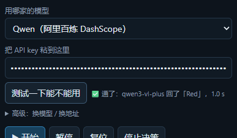

<p align="center">
  
</p>

**English** | [简体中文](README.zh-CN.md)

# Clumsy VLM Duck

**Try it in your browser (no install, no sign-up): <https://xenderyang-duck-vlm-simulator.static.hf.space/index.html>**

(Or through the Space page: <https://huggingface.co/spaces/XenderYang/duck-vlm-simulator>)

A microduck robot simulator that runs entirely in the browser. Physics (MuJoCo WASM),
policies (onnxruntime-web) and the vision-language model call **all happen on the
visitor's machine** — there is no backend and nothing to pay for.

At every step the VLM emits a single **discrete action symbol**
(`FWD` / `TURN_L` / `LOOK_DOWN` / `DONE` …). An interpreter turns that into actual
motion, the duck takes a new photo, and the photo goes back to the model. A real
closed loop.

> No API key needed: the rule-based mode is fully playable. To try VLM zero-shot,
> bring your own key (Qwen / Gemini / Claude all supported). The key stays in your
> browser and is sent only to the vendor you pick.

## Turning on VLM mode

In the **Decision** panel on the right, click **VLM 模式（填自己的 key）**, then do
exactly three things:

1. Leave **用哪家的模型** on its default, **Qwen** (switch to Gemini / Claude if you want)
2. Paste your API key into **把 API key 粘到这里**
3. Click **测试一下能不能用** — a ✅ means it works, so hit **▶ 开始**

The model is a dropdown (just pick one) and the base URL is filled in for you; both
live under **高级：换模型 / 换地址** and you normally never touch them.
The key lives only in your browser's localStorage and goes only to the vendor you
picked — this project has no backend, so there is nowhere for it to leak to.



---

## What it does

| | |
| --- | --- |
| Scenes | 3 (workshop / home with rooms / obstacle course), hot-swapped in the page, no restart |
| Tasks | 23 shipped with the scene packs (each tagged with a ★ difficulty, easy ones first), or just type a sentence |
| Completion | For curated tasks the **scene pack's success predicate decides** (entered the zone, arrived and settled are checked live) — not the model saying it is done |
| Choreography | Instructions with no target object — "walk forward 1 m, roll once, then dance" — are executed step by step and verified against the world (metres walked, degrees turned). No vision, no model calls |
| Actions | 8 base tokens plus locally-verified skills (roll over, dance); pushing and kicking run as a rule loop |
| Controls | Mouse zoom/orbit/pan, one-click three-view composite, and a decision log showing **the exact image the model was given** |

> **The duck mostly works by sight.** If the target is not in its camera view it will
> spin around looking for it, so tasks like "climb the steps" or "find the ball in the
> other room" need the target (or a landmark on the way) visible. Start with the ★ easy
> ones, or use a choreography instruction, which needs no vision at all.

**Scene tasks that actually pass**: `walk_forward_0_5` (0.5 m forward), `turn_left_90`,
`enter_red_zone` (10.7 s, ending 0.24 m from the zone centre), `push_red_cube` (cube into
the blue zone), `kick_ball_to_zone` (ball into the green zone), plus a real-model
zero-shot "go to the orange ball and stop next to it".

## Repository layout

```
web_sim/       the browser simulator (the main line; every test lives here)
duck_scenes/   scene packs — the simulator's input (scene XML / metadata / task definitions)
duck_vlm/      Python reference implementation for the server side (same prompts, tokens, intent parsing)
duck_play/     Python duck library (camera model etc., used by duck_vlm)
docs/          reproduction and extension notes
THIRD_PARTY_NOTICES.md   third-party assets and their licences
_local/        **machine-local material only** (research notes, upstream reference clones,
               original zips, early experiments, .tmp leftovers). Not part of the repo, never
               uploaded; deleting the folder breaks nothing.
```

## Run it locally

```powershell
git clone https://github.com/YDxun/clumsy-vlm-duck && cd clumsy-vlm-duck/web_sim
npm install

# Flatten a scene. The meshes are not in this repo: they are fetched from a pinned
# upstream commit and checked against a sha256 manifest.
F:\anaconda_ydx\python.exe tools\flatten_scene.py duck_workspace_v1

# The policy ONNX files are not published either. Put them in assets/policies/
# following policies.json:
#   alpha_walking / alpha_stand -> pollen-robotics/microduck-policies (Apache-2.0)
#   alpha_standup              -> trained by this project

node tools\serve.mjs            # http://127.0.0.1:8787/
```

> The detailed engineering log — why each decision was made and which traps were
> hit — is [`web_sim/README.md`](web_sim/README.md). It is Chinese-only for now;
> translations welcome.

## Why you can trust that it runs

Every claim in this project comes with a command you can re-run, instead of "looks right":

| Layer | Command | Status |
| --- | --- | --- |
| Task schema | `node tools/check_task_schema.mjs` | PASS (all 23 tasks derive their target from the success predicate) |
| Mesh pin | `node tools/check_mesh_pin.mjs` | PASS (38/38 byte-identical to the pinned upstream commit) |
| Physics parity | `node tools/verify_wasm.mjs <scene>` | PASS ×3 (every body + a hash over all geom positions matches Python MuJoCo) |
| Rendering | `node tools/verify_render.mjs` | 14/14 (pixel level: the duck on screen is the duck in the physics) |
| Decision layer | `node tools/test_agent.mjs` | 125/125 (includes choreography parsing) |
| Closed loop | `node tools/verify_agent.mjs` | 37/37 (includes real HTTP + CORS) |
| Page | `node tools/verify_page.mjs` | 77/77 (clicks buttons, fills a key, tests the connection, re-runs with a new instruction, runs a choreography, downloads the composite) |
| Real model | `node tools/verify_real_vlm.mjs` | 7–8/8 (real Qwen3-VL walks to the ball and stops on its own; the last check depends on making it within 0.45 m) |
| Live HTML | `python tools/check_space_encoding.py` | PASS (0 mangled characters on the CDN) |
| Published build | `node tools/smoke_site.mjs _site` | 8/8 (no node_modules, everything from CDN) |

`npm run verify` runs the whole chain; the real-model layer skips itself when no key is set.

## Reproducing and extending

- **Add a scene / add a task** → [`docs/REPRODUCE.md`](docs/REPRODUCE.md)
- **Train a new policy and export ONNX** → same document (includes the training command)
- **Publish to the web** → same document (one command to build, smoke-test and upload)

## Known limitations (stated honestly)

- **First load takes ~20–35 s.** The bottleneck is parsing 22 MB of robot meshes, not
  the network. A machine with a GPU helps, but this order of magnitude is inherent to
  the approach. There is no progress bar yet.
- **The upstream "dance" and "stand up" policies do not work as advertised** (measured):
  `happy_hop` (the old dance) tips the duck onto its side and leaves it there, and
  `alpha_standup` cannot get it back on its feet from that pose. The only reliable one is
  `roulade` (roll) — 3/3 runs, about 4–5 s from lying flat back to standing. So the dance
  is withdrawn from the VLM vocabulary and from the examples (a choreography now skips it
  and says why), the "get up" button uses roulade, and a choreography verifies the duck is
  upright before reporting completion.
- **A ball cannot be pushed.** It is 15 g; any walking contact is an impulse, so
  pushing just launches it. Balls go through the kick policy; pushing is for cubes
  and cups.
- **Cross-room search in the home scene** has not completed a full task yet.
- Occlusion is computed by the renderer (the target is drawn flat magenta and the
  pixels are counted) because the official WASM `mj_ray` cannot return a geom id.

## Licence

This project's **own code** is Apache-2.0 (see `LICENSE`).

The robot 3D models are upstream **hardware design files, CC BY-SA-NC**
(NonCommercial + ShareAlike) and are **not distributed by this repository or by the
live site**: the browser fetches them from a pinned upstream commit and verifies each
one against a sha256 manifest. The ONNX policies are Apache-2.0 and are published with
the site. Full details in [`THIRD_PARTY_NOTICES.md`](THIRD_PARTY_NOTICES.md).

The architecture follows [rokbenko/quackd](https://github.com/rokbenko/quackd)
(independent implementation, no code copied). Not affiliated with or endorsed by
Pollen Robotics or Hugging Face.
