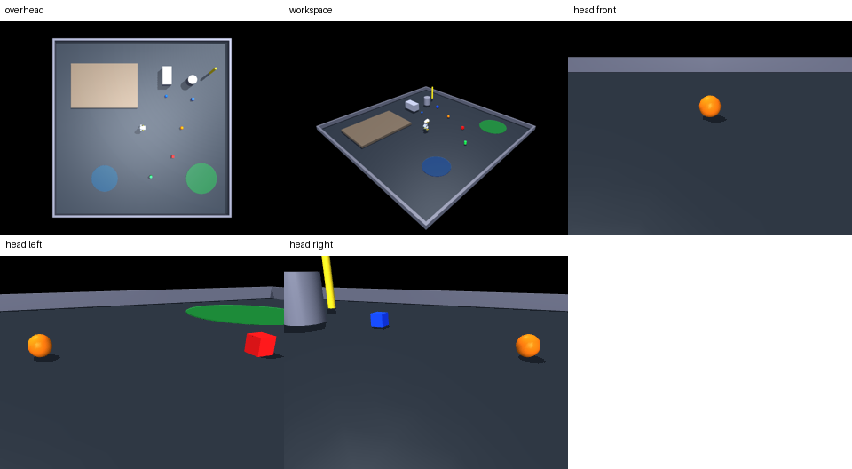

# MicroDuck MuJoCo 场景验证报告

## 环境

- 日期: 2026-09-14 (Asia/Shanghai)
- Python: 3.12.7
- MuJoCo: 3.12.0
- 平台: Windows-11-10.0.26200-SP0
- 运行时: `F:\anaconda_ydx\python.exe`
- 渲染后端: Windows `MUJOCO_GL=wgl`

## MicroDuck 模型

- 模型: `robot/robot_allcollisions.xml`
- root body: `trunk_base`
- 14 个 position actuators / controlled joints，4 个 head joints (`neck_pitch`, `head_pitch`, `head_yaw`, `head_roll`)
- `head_camera` named camera 方向为 -X；DuckVLM 实际使用 `render_headcam_rgb`/LocalSim 头摄自由相机路径，验证采用该现有路径
- 首个场景计数: nq=56, nv=50, nu=14, nbody=24, ngeom=97, njnt=20

## 修复内容与原因

1. **include 与 mesh 相对路径**：zip 未包含机器人 XML；加入真实 `robot_allcollisions.xml` 和 94 个 assets，场景改为 `../../robot/robot_allcollisions.xml`，机器人 XML meshdir 改为 `../../robot/assets`，避免绝对路径。
2. **自由关节/关键帧**：主球 freejoint 命名 `ball_free` 以满足 `LocalSim`；补 `initial` qpos+ctrl keyframe，使 reset 使用真实站立位姿。
3. **home 初始重叠**：球从与 tea table 相互穿透的位置移到 `(2.25,-1.70,0.035)`；beacon 移出 sofa；实测门宽由碰撞面计算为 1.40 m。
4. **obstacle 几何**：ramp 原与 corridor 左墙体积相交，corridor 移到独立 x 区间；低摩擦 patch 移出墙内；ramp 最低点保持 z≈0。
5. **camera**：实测头摄后确认 RGB 左右不镜像；home 原先头摄约 82% near-white，降低 floor/ambient 后均值约 100。
6. **metadata/tasks**：用 expanded MuJoCo model 反向校准 body、尺寸、质量、位姿、zone、beacon、camera；修复中文指令编码和 workspace 20 cm/40 cm 文案矛盾。
7. **validate.py**：从静态 XML 检查者改为真实 MuJoCo/ONNX/task evaluator/camera 测试器。

## 验收矩阵

| Scene | XML_LOAD | ROBOT_COMPATIBILITY | INITIAL_CONTACT | PHYSICS_2000_STEPS | TASK_REFERENCES | SUCCESS_EVALUATOR | CAM_OVERHEAD | CAM_WORKSPACE | DUCKVLM_CAMERA | LOCOMOTION | OBJECT_INTERACTION |
|---|---|---|---|---|---|---|---|---|---|---|---|
| duck_workspace_v1 | PASS | PASS | PASS | PASS | PASS | PASS | PASS | PASS | PASS | PASS | PASS |
| duck_home_v1 | PASS | PASS | PASS | PASS | PASS | PASS | PASS | PASS | PASS | PASS | PASS |
| duck_obstacle_v1 | PASS | PASS | PASS | PASS | PASS | PASS | PASS | PASS | PASS | PASS | PASS |

## 2000-step 物理稳定性

| Scene | Passive finite | NaN | max |qvel| | max |qacc| | alpha_stand 10 s | min upright | max root move |
|---|---:|---:|---:|---:|---:|---:|---:|
| duck_workspace_v1 | PASS | 0 | 6.608 | 795.1 | PASS | 0.999966 | 0.000283252 m |
| duck_home_v1 | PASS | 0 | 6.608 | 795.1 | PASS | 0.999966 | 0.000283252 m |
| duck_obstacle_v1 | PASS | 0 | 6.608 | 795.1 | PASS | 0.999966 | 0.000283252 m |

说明：零运动指令下 MicroDuck 本体保持有限值且自由物体不漂移，但双足模型在无平衡策略时会倒地；加入项目实际 `alpha_stand.onnx` 后 2000 substeps 保持直立，这才是可执行验收条件。

## 场景专项结果

- workspace: ball displacement 0.418476 m；cube displacement 0.022785 m；最小闭环距离 0.373103 m。
- home: collision-free door width 1.4000 m；实际穿越 1.012681 m；owner/stranger 均接地且颜色不同。
- obstacle: ramp angle 12.000028 deg；最低点 z=1.06018e-08 m；corridor width 0.500000 m；低/高摩擦实穿通过。

## Camera 结果

所有场景均生成 640×480 的 `cam_overhead`/`cam_workspace`，并按渲染差分验证 DuckVLM 头摄：主球 front 居中、left 在左、right 在右、转身后不可见；三组相机均非黑屏、方向正确、无左右镜像。



## Task evaluator

success evaluator 使用修改后的真实 MjData 状态测试；`success_hold_s` 在 workspace 的 walk/kick/push、home 的 come/follow/retrieve、obstacle 的 rough/push/multi-target 中均验证。failure evaluator 验证 `fallen_for_s`、`outside_bounds` 和 `timeout`。

## DuckVLM integration

- RGB/head-camera：PASS（使用项目现有头摄代码路径，front/left/right 实测）。
- State + RGB + dry-run decision：PASS；本机没有 VLM provider/API key，因此没有声称真实外部模型推理或完整语言指令闭环成功。
- 已知外部代码风险：`duck_play/perception/camera.py:DuckHeadCam` 的投影 right 轴与 MuJoCo 渲染图像水平方向相反；这会影响 affordance overlay 的 target UV，不影响本包的 head-camera RGB。建议在项目代码中用 `right=np.cross(f,ref); up=np.cross(right,f)` 后回归 annotation。

## 实际关键命令

```powershell
Expand-Archive -LiteralPath MicroDuck_scenes_20260914.zip -DestinationPath .
python -c "from huggingface_hub import snapshot_download; snapshot_download('XenderYang/microduck-cloud-policies', allow_patterns=['*.onnx'], local_dir='policies')"
python -m py_compile validation_core.py scenes\duck_workspace_v1\validate.py scenes\duck_home_v1\validate.py scenes\duck_obstacle_v1\validate.py
cd scenes\duck_workspace_v1; python validate.py scene.xml
cd scenes\duck_home_v1; python validate.py scene.xml
cd scenes\duck_obstacle_v1; python validate.py scene.xml
python validate_all.py
```

## 最终结论

```text
SCENE_VALIDATION: READY
DUCKVLM_INTEGRATION: PARTIALLY_READY (external VLM inference not credential-tested)
OVERALL: READY
```
