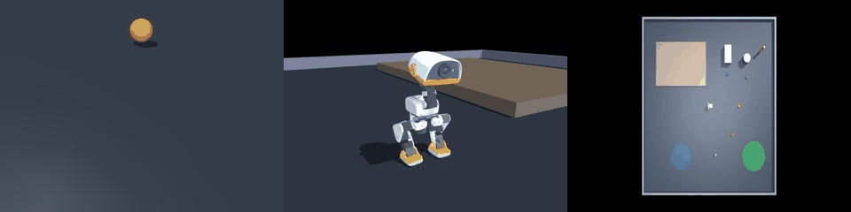
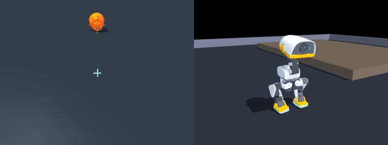

# DuckVLM 场景接入与复杂任务验证 · 2026-09-14

## 1. 场景包与运行时

来源：`MicroDuck_scenes_20260914_validated.zip`（`duck_workspace_v1` / `duck_home_v1` / `duck_obstacle_v1`）

- `DUCK_SCENE_ID` / `.duck_scene_id` 场景选择，`GET /api/scenes`、`POST /api/scenes/select`。
- `metadata.yaml` 语义实体解析（含 `people`），`tasks.yaml` 由真实 `TaskEvaluator` 判定。
- 任务成功由 MuJoCo 真值判定，不依赖模型主观 `DONE`。

## 2. 第三轮优化（2026-09-14）

### 2.1 新增头部动作 token：`LOOK_DOWN` / `HEAD_CENTER`

问题：鸭子踢球时球会掉出头摄画面，模型再也没法重新找到球。

实测（`kick_ball_to_zone`）：球距 0.30 m 时可见、投影 v=224；0.25 m 时 v=240 贴画面最底行；
0.23 m 起彻底出画，之后 15 步全部无效。

原因：鸭子**有** `neck_pitch` / `head_pitch` / `head_yaw` / `head_roll` 四个受控关节
（`robot_allcollisions.xml:183-205`），但动作词表里没有任何头部 token，头始终由行走策略
输出的固定姿态驱动，VLM 无法低头。

正向运动学标定（`mj_forward` 读 `yaw_roll_motion` 前向 z 分量）：

| 关节 | 变化 | 效果 |
| --- | --- | --- |
| `head_pitch` | +θ | 低头 |
| `neck_pitch` | +θ | 抬头 |

实现：

- `actions.py` 新增 `LOOK_DOWN`（`head_pitch` +0.60 rad ≈ 34°，保持站立）与
  `HEAD_CENTER`（回到中立姿态）。
- `interpreter.py` 头部动作**锁存**：动作时长结束后仍保持该头姿，直到 `HEAD_CENTER`
  或 episode 结束，这样下一步拍到的图像才是低头视角。
- `sim_server.py` 每控制步在策略输出后覆写头关节 ctrl；相机投影与渲染都跟随真实头关节，
  因此 `target_visible` 自动随之变化。

俯仰角选择（按可见距离扫描）：

| 球距 | 平视 | LOOK_DOWN +0.60 | +0.80 |
| --- | --- | --- | --- |
| 0.45 | 可见 | 可见 | 不可见 |
| 0.35 | 可见 | 可见 | 不可见 |
| 0.30 | 不可见 | 可见 | 可见 |
| 0.20 | 不可见 | 可见 | 可见 |
| 0.15 | 不可见 | 可见 | 可见 |
| 0.10 | 不可见 | 不可见 | 不可见 |

+0.60 覆盖 0.15~0.45 m 连续区间并与平视视角重叠，因此选它。0.10 m 以内仍为盲区。

### 2.2 双视角拼接录制

- `types.py` 早已预留 `VlmObservation.extra_views`，此前无人写入；现已接通。
- `host.py` 新增 `capture_main()`，`loop.py` 把主视角放进 `extra_views`。
- `recorder.py` 新增 `save_extra_views()`：每步同时写
  `frames/`（鸭头摄）、`frames_main/`（第三人称场景视角）、
  `frames_dual/`（两者左右拼接 640x240）。
- 主视角只用于录制，**从不进入 VLM prompt**。

### 2.3 上帝视角真值问题：看不见就不给真值

用户要求：鸭子没看到目标时不能用上帝视角真值，看到了才可以用（当前无 depth 传感器）。

`state.py` 改动：

- 先算目标是否在头摄视野内，再做遮挡射线检测（`mj_ray`，忽略 <0.05 m 的自遮挡）。
- **可见** → 才写入 `target_range_m / target_bearing_rad / target_world_xyz`，对应"检测器+测距
  能给出同样信息"的合理假设。
- **不可见（出画或被墙挡住）** → 这四个字段全部置 `None`，不再泄漏真值。
- 评测本身仍用真值判定成败（评测不是观测）。

`plugins.py` 相应改造：`SearchAlignPlugin` 不再假设盲区里有 bearing。
盲区时它只在**前 6 步**把转向锁成单一方向（有界扫描，不交替），之后把控制权交还模型，
让它 `FWD` 去换观测点；目标可见时才用 bearing 做"已朝向就前进/否则转向对齐"。

### 2.4 顺带修掉的两个 bug

1. **场景出生点被写死**：`LocalSim.reset()` 一直把鸭子重置到 workspace 原点、球放到
   `(0.9,0)`，**所有场景共用**。也就是说 Home 的"跨房间搜索"此前并不是跨房间。
   改为按场景 `<keyframe name="initial">` 重置后实测：
   鸭子 `(-1.798,-0.013)`、球 `(2.25,-1.7)`，才是真正的跨房间布局。
2. **`record=False` 会打崩服务**：`save_image()` 在 recorder 未激活时抛
   `RuntimeError: recorder is not active`，被 `local_sim_loop` 直接抛出。
   已改为未记录时返回空串。

## 3. 复验结果（zero_shot + Qwen3-VL，成功判定=MuJoCo 真值）

| 场景 | 任务 | 结果 | 步数 |
| --- | --- | --- | --- |
| `duck_workspace_v1` | `walk_to_ball` | ✅ success | 8 |
| `duck_workspace_v1` | `walk_turn_stop` | ✅ success | 12 |
| `duck_home_v1` | `search_ball_across_rooms` | ❌ timeout | 26~33 |
| `duck_home_v1` | `come_to_owner` | ❌ timeout | 20~24 |
| `duck_home_v1` | `follow_owner` | ❌ timeout | 28~33 |
| `duck_workspace_v1` | `kick_ball_to_zone` | ❌ timeout | 20~24 |

**重要：Home 三个任务此前"通过"并不成立。** 那是因为
(a) 出生点 bug 让鸭子站在门口、球就在 0.9 m 外，(b) 不可见时也给了真值 bearing。
修正这两点后，Home 任务变成真正的跨房间探索，当前会失败。

失败机理（`search_ball_across_rooms` 逐帧）：球全程 4 步从未进入视野，鸭子在西侧房间内
游走，`x` 从 -1.8 漂到 -2.34、离球距离从 4.39 m 涨到 4.85 m，从未朝门洞（x=0, |y|<0.7）
前进。模型缺少"探索/找门洞"的能力，插件也只提供原地扫描。

## 4. 已验证的能力（可复现）

- 头部动作端到端：`LOOK_DOWN` 后头摄图像 md5 由 `7768b49af4` 变为 `a8f8bf1aaf`，
  `head_delta={'head_pitch': 0.6}`；`HEAD_CENTER` 再变 `7a5073affc`、`head_pitch: 0.0`。
- 双视角录制：单次会话同时产出 `frames`/`frames_main`/`frames_dual` 各 N 帧，
  拼接图 640x240。
- 可见性门控：workspace 球在 0.9 m 直线上→可见并给真值；home 球隔墙→
  `visible=False, range=None, bearing=None`。
- 过早 `DONE` 被真值 evaluator 否决（日志 `done_ignored`），不再提前结束 episode。
- 单元测试 19 项全绿（含头部锁存、盲区扫描有界、双视角录制、token 注册）。

## 5. 下一步

1. **跨房间探索插件**：无目标时的行为不应只是原地扫描，需要"走向最近的开口/门洞并
   进入新区域"的探索子目标（可用场景 XML 的门洞几何，或纯视觉的"可通行方向"启发式）。
2. **踢球站位**：`kick/retrieve` 需要显式站位点（球位 + 朝绿区反方向偏移），
   把"绕到球后方"变成子目标；球 <0.10 m 时加更深的低头档位。
3. **深度感知**：开 MuJoCo depth 渲染或接真机 depth，把"可见时的距离"从特权状态
   换成真实感知，为真机迁移和论文对比做准备。
4. 复跑 `duck_obstacle_v1` 的 `recover_after_fall` / `multi_target_navigation`。
