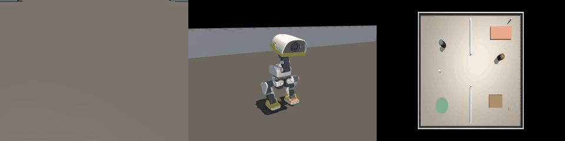

# DuckVLM 场景接入与复杂任务验证 · 2026-09-14

## 0. 概览

- 场景包：`duck_workspace_v1` / `duck_home_v1` / `duck_obstacle_v1`（`MicroDuck_scenes_20260914_validated.zip`）
- 闭环：任务/元数据 → VLM 看头摄+状态 → 输出一个离散动作 token → 解释器执行 → MuJoCo 更新 → 再拍照
- 成败判定：场景包 `TaskEvaluator` 的 MuJoCo 真值，不采信模型主观 `DONE`

## 1. 动作空间

`FWD/BACK/STRAFE_L/R/TURN_L/R`（速度，经 `alpha_walking`）、`STOP/STAND`、
`LOOK_DOWN/HEAD_CENTER`（头关节，锁存）、`KICK_L/R`、`ROLL`、`DANCE`、`DONE`。

转向标定（`/ws cmd` 稳态测速）：

| 指令 wz | 实测角速度 |
| --- | --- |
| -1.0 | -0.011 rad/s（死区，旧 `TURN_R` 等于空动作） |
| -1.5 | -1.018 rad/s（现用） |
| +1.0 | +0.423 rad/s |
| +1.5 | +0.663 rad/s（现用） |

头部标定（FK）：`head_pitch` +θ = 低头，`neck_pitch` +θ = 抬头。
`LOOK_DOWN` 取 +0.60 rad（34°），按可见距离扫描选值，覆盖 0.15~0.45 m 且与平视重叠：

| 球距 | 平视 | LOOK_DOWN +0.60 |
| --- | --- | --- |
| 0.45 / 0.35 | 可见 | 可见 |
| 0.30 / 0.20 / 0.15 | 不可见 | 可见 |
| 0.10 | 不可见 | 不可见（仍为盲区） |

## 2. 观测：看不见就不给上帝视角真值

`state.py`：目标在头摄视锥内**且** `mj_ray` 无遮挡时，才写入
`target_range_m / target_bearing_rad / target_world_xyz`；否则全部 `None`
（当前无 depth 传感器，盲区不可能知道距离）。评测仍用真值判定，因为评测不是观测。

实测：workspace 0.9 m 直线目标 → 可见并给真值；home 隔墙目标 → `visible=False, range=None`。

## 3. 本轮新增：跨房间探索插件

需求：无目标时不能只是原地扫描，要朝最近的开口/门洞走并进入新区域。

`duck_vlm/map.py`（纯静态地图，属机器人可合法持有的先验，**不含目标隐藏位置**）：

- `wall_segments()`：解析场景 XML 中所有 `*wall*` box。
- `doorways()`：同一墙线上两段墙之间的空隙 → 门洞中心与通行轴。
- `floor_bounds()` / `coverage_waypoints()`：地板范围上的割草机式粗网格。

实测提取结果（与 XML 手算一致）：

| 场景 | 门洞 | 宽度 | 通行轴 | 覆盖点 |
| --- | --- | --- | --- | --- |
| `duck_home_v1` | 1 个，中心 (0.00, 0.00) | 1.50 m | x | 16 |
| `duck_workspace_v1` | 0 | - | - | 9 |
| `duck_obstacle_v1` | 0 | - | - | 12 |

`duck_vlm/plugins.py` · `ExplorePlugin`：

- 航点顺序 = 门洞中心 → 门洞外 1 m 的穿越点 → 从该点按距离排序的覆盖网格。
  门洞排在最前，保证先出房间，而不是就近乱走。
- 转向对准 + 走到 `ARRIVE_M=0.30` 内即推进下一个航点。
- 三道闸门，避免抢走不该它管的步：
  1. `SKIP_TASKS = walk_turn_stop / rough_ground_walk / recover_after_fall /
     narrow_corridor / orbit_stranger` —— 目标是姿态、步态或绕行的任务；
  2. 目标当前可见 → 让位给模型；
  3. `SEEN_HOLD_STEPS=8`：刚看见过目标就丢了，属于"球掉到下巴以下"的局部感知问题，
     不该掉头去探索。
- 目标不可见且推进不到时，把探索意图写进 `SUBTASK`：
  `EXPLORE: ... Head for the next opening/waypoint at (x,y) ...`。

### 低延迟快路径

每步都问 VLM 要花 ~1.2 s 的 episode 预算，而走路一步只有 0.55 s。当局面**无歧义**时
由插件直接决定，不再往返模型（记录里 `source` 字段标为 `reactive`，可做消融）：

- 探索航点已知（`explore`）；
- 目标可见、距离 > 0.45 m：正对着就 `FWD`，偏了就往正确方向 `TURN`（`reactive`）。

其余一切（最终接近、踢球、停止、多物体选择、丢失目标）仍交给模型。
实测 `search_ball_across_rooms`：`reactive` 82~92 步 + `vlm` 7~16 步，
步数从 32 提升到 63~90，鸭子在 60 s 场景预算内走得远得多。

## 4. 双视角 → 三视角拼接录制

要求：全景既要看得全，也要看得见鸭子。单张全景里鸭子只有几个像素，
所以改成三格拼接，每格 320x240，合计 **960x240**：

```
[ 鸭头摄 (第一视角) | 第三人称跟随 (鸭子大、动作清楚) | 全场俯瞰 (整张平面图 + 鸭子的位置) ]
```

- `sim_server.render_overview()`：用场景自带的 `cam_overhead` 固定相机渲染全场
  （`cam_overhead` 在 home 位于 (0,0,7)，48° FOV，覆盖 6x5 m 地板）。
- `sim_server.headcam_loop()` 在录制期间额外渲染跟随视角（每帧）与俯瞰（隔帧），
  再调 `record_demo_frame()`，约 10 fps。
- `recorder.save_live_dual(head, *extra)`：任意多格拼接，写 `frames_dual_live/`。
- 逐步（每个决策一次）的 `frames/`、`frames_track/`、`frames_overview/`、`frames_dual/` 同样保留。

实测：`walk_to_ball` 一次会话 live 119 帧 / 逐步 8 帧；拼图尺寸 960x240。
demo 时长从约 6 s 提到 **14~20 s**。

## 5. 复验结果（zero_shot + Qwen3-VL，成败=MuJoCo 真值）

| 场景 | 任务 | 结果 | 步数 |
| --- | --- | --- | --- |
| `duck_workspace_v1` | `walk_to_ball` | ✅ success | 8 |
| `duck_workspace_v1` | `walk_turn_stop` | ✅ success | 11 |
| `duck_home_v1` | `search_ball_across_rooms` | ⏳ 跨房间成功，60 s 预算耗尽 | 63~90 |
| `duck_home_v1` | `come_to_owner` | ❌ timeout | 60 |
| `duck_workspace_v1` | `kick_ball_to_zone` | ❌ timeout | 20~24 |

`search_ball_across_rooms` 三次独立运行（鸭子 (-1.8,0)，门洞 (0,0)，球 (2.25,-1.7)）：

| 运行 | 步数 | 最大 x | 最近距球 |
| --- | --- | --- | --- |
| A | 60 | +1.83 | 1.41 m |
| B | 89 | +1.30 | 1.17 m |
| C | 63 | +1.11 | 1.29 m |

三次都**穿过门洞进入东侧房间**（修复前从未离开过西侧房间），随后目视捕获小球
并把距离从 4.39 m 收到 1.17~1.41 m，最后卡在场景包 `tasks.yaml` 的
`max_duration_s: 60`。也就是说：探索能力已打通，剩余的差距是时间预算，
不是"走不出去"。




## 6. 本轮定位并修掉的问题

1. **探索插件抢走姿态任务**：`walk_turn_stop` 从第 5 步起被打上 EXPLORE 并被拽向
   覆盖航点，任务超时。→ 加 `SKIP_TASKS`。
2. **刚丢目标就掉头远征**：`walk_to_ball` 中球在 0.53 m 掉出画面后，探索插件把鸭子
   往远处航点拖，反而离球越来越远。→ 加 `SEEN_HOLD_STEPS=8` 的记忆闸门。
3. **看见目标就把探索进度清零**：`index=0` 导致球再次丢失时鸭子横穿整间房退回起点
   （1.22 m → 4.10 m）。→ 取消回退，改为保持巡游进度。
4. **贪心就近选点**：曾尝试"重入时选最近航点"，结果鸭子只在出发房间里打转
   （max_x=-1.19，从未出门）。→ 回退为严格按门洞优先的顺序巡游。
5. **场景出生点写死**：`LocalSim.reset()` 对所有场景都重置到 workspace 原点与 (0.9,0) 的球，
   于是 Home 的"跨房间"其实并不跨房间。→ 改用场景 keyframe，
   实测鸭子 (-1.798,-0.013)、球 (2.25,-1.7)。
6. **`record=False` 打崩服务**：`save_image()` 在 recorder 未激活时抛异常，被
   `local_sim_loop` 抛出。→ 未记录时返回空串。

## 7. 下一步

1. **跨房间后的收尾**：进东侧房间后先做一个"扫视 + LOOK_DOWN"再长途跋涉，
   以及把最终接近也放进低延迟层，才能在 60 s 内完成。
2. **踢球站位**：`kick/retrieve` 需要显式站位点（球位 + 朝绿区反方向偏移）。
3. **深度感知**：开 MuJoCo depth 渲染或接真机 depth，把"可见时的距离"从特权状态
   换成真实感知。
4. 复跑 `duck_obstacle_v1` 的 `recover_after_fall` / `multi_target_navigation`。

---

## 附注（2026-09-15）：人体仿真已整体移除

本文表中的 `come_to_owner` / `follow_owner` / `orbit_stranger` 三个人物任务**已从场景包删除**。原因：这三个任务依赖的”人“只是两个静止胶囊（`person_owner` / `person_stranger`，无关节、无 mocap），`follow_owner` 对着静止目标近乎平凡，测不出跟随能力；且实测鸭子头摄（原点 z=0.253 m、光轴下俯 20°、上边缘在地平线下 4.3°）在 0.5~4.5 m 处只能看到人的 z≈0~0.6 m 高度带，即小腿以下，视觉上也不成立。

项目决定后续不做人体仿真，因此：删除两个 person body、metadata 的 `people` 段、三个任务，并同步修改 `validation_core.py` 的 `HOME_LAYOUT`、`SUCCESS_EVALUATOR`、`DUCKVLM_DECISION_DRY_RUN`（后者原本假设出生点就能看到球，与”看不见就不给真值“的可见性门控冲突，改为在球确实可见的位姿下验证）。

三套场景复验全部 PASS，全项目任务数 17 → 14，`duck_home_v1` 保留 3 个任务。本文其余内容为当次实验的历史记录，未作改写。
