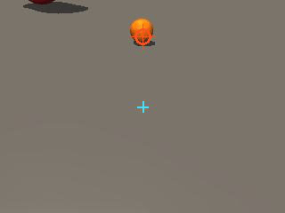
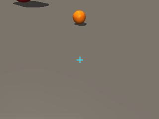
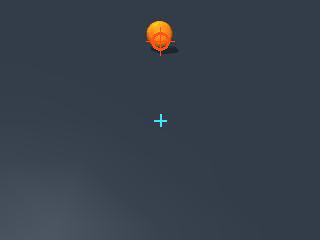
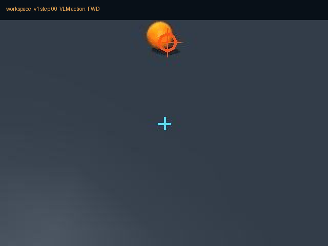

# DuckVLM 场景包接入与复杂任务验证 · 2026-09-14

## 1. 场景包验证

来源：`MicroDuck_scenes_20260914_validated.zip`

- `duck_workspace_v1`
- `duck_home_v1`
- `duck_obstacle_v1`

独立复验结果：

- MuJoCo XML 加载：PASS
- 机器人兼容性：PASS
- 初始接触和静态重叠：PASS
- 2000-step 物理稳定性：PASS
- 任务引用检查：PASS
- 成功/失败 evaluator：PASS
- overhead/workspace 相机：PASS
- DuckVLM 头摄方向：PASS
- locomotion 和 object interaction：PASS

## 2. 运行时能力

- `DUCK_SCENE_ID` 和 `.duck_scene_id` 场景选择。
- `GET /api/scenes` 场景和任务列表。
- `POST /api/scenes/select` 请求场景切换。
- `metadata.yaml` 语义实体解析，例如 `red cube`、`橙色球`、`zone_green`。
- `tasks.yaml` 通过场景包真实 `TaskEvaluator` 执行。
- 任务成功由 MuJoCo 真值自动判定，不依赖模型主观输出 `DONE`。
- 修复 DuckHeadCam 水平轴，使其和 MuJoCo 渲染图像一致。

## 3. 本轮优化（2026-09-14 第二轮）

用户反馈三类问题：任务进度没有 verbalize、背对目标时转不过去、Home 场景跨房间没有复验。
逐条定位后，发现真正的瓶颈是**底层动作标定**而不是 prompt，改动如下。

### 3.1 任务进度 verbalization（距目标米数 + 航向误差）

`duck_vlm/plugins.py` · `SubgoalPlugin.before_decision`：

- 接近类任务（`walk_to_ball` / `come_to_owner` / `go_to_beacon` 等）会把
  `current range is X.XX m` 写进 `SUBTASK`。
- `walk_turn_stop` 会把**到目标区域的距离**和**航向误差**同时写进
  `SUBTASK`，例如：

  ```text
  You are inside the target region. Turn right toward -90 deg.
  Current heading is -58 deg, error is -32 deg.
  ```

- `AFFORDANCE` 同时给出 `X.XXm away, bearing X.XXrad, visible=yes/no`，
  并在头摄图上画出目标投影点。
- `zero_shot.txt` 明确要求模型把 `SUBTASK / ROBOT STATE / AFFORDANCE`
  当作可信进度测量，并禁止左右交替转。

### 3.2 动作标定修复：转向指令落在策略死区（关键 bug）

用 `/ws` 的 `cmd` 通道逐条标定 `wz -> 实际角速度`，2.5 s 稳态测量：

| 指令 wz | 实测角速度 | 说明 |
| --- | --- | --- |
| `-0.5` | `-0.015 rad/s` | 几乎不动 |
| `-1.0` | `-0.011 rad/s` | **原 `TURN_R`，实际是空动作** |
| `-1.5` | `-1.018 rad/s` | 可用 |
| `+0.5` | `-0.003 rad/s` | 几乎不动 |
| `+1.0` | `+0.423 rad/s` | 原 `TURN_L`，偏弱 |
| `+1.5` | `+0.663 rad/s` | 可用 |
| `vx=+0.35` | `+0.156 m/s` | 直行 |

结论：`alpha_walking` 策略在 `|wz| < ~1.2` 有明显的死区，原来的
`TURN_R = -1.0` 基本不动，所以"鸭子完全背对小球时转不过去"，而
`TURN_L = +1.0` 还能勉强工作 —— 这正好解释了此前**只有右转失败**的现象。

`duck_vlm/actions.py`：

```diff
- "TURN_L": ActionSpec(..., 0.35, (0.0, 0.0,  1.0)),
- "TURN_R": ActionSpec(..., 0.35, (0.0, 0.0, -1.0)),
+ "TURN_L": ActionSpec(..., 0.55, (0.0, 0.0,  1.5)),
+ "TURN_R": ActionSpec(..., 0.55, (0.0, 0.0, -1.5)),
```

修复后单个 `TURN_R` 实测可产生 15~43° 转角。

### 3.3 决策优化：`SearchAlignPlugin`

`duck_vlm/plugins.py` 新增/重写 `SearchAlignPlugin`，覆盖三种失败模式：

1. **目标就在正前方但滑出头摄视野**（Home 场景的 owner 是高个子，
   头摄俯角 -20°，很容易看不到）→ 只要本 episode 曾看见过目标且
   `|bearing| < 0.55 rad`，就把 `TURN_L/TURN_R` 改写成 `FWD`，避免
   在接近 0 的 bearing 符号上抖动。
2. **目标接近 ±180°**（完全背对）→ bearing 符号会被噪声反复翻转，
   插件用迟滞保留上一次的转向方向，强制朝同一侧转到底。
3. **目标明显偏轴**（`|bearing| >= 0.55`）→ 把模型选的转向改写成正确
   方向，杜绝 `TURN_L/TURN_R` 交替。

`orbit_*` / `*corridor*` 任务豁免，因为这些任务需要绕行。
插件状态在 `loop.start()` 通过 `plugins.reset()` 复位，不会跨 episode 泄漏。

### 3.4 转向量自适应（避免过冲）

`duck_vlm/loop.py` · `_duration_scale`：

- 通用：航向误差 `<15°` 时把转向时长压到 `0.45x`，`<35°` 时压到 `0.70x`。
- `walk_turn_stop`：已进入目标区域后进一步压缩到 `0.35x`。

### 3.5 语义实体解析漏掉了 `people`

`duck_vlm/scenes.py` · `SceneSpec.resolve_body` 只遍历了 `objects` 和
`zones`，**没有遍历 `people`**，导致 `owner` / `stranger` 永远解析失败：

```text
ROBOT STATE: ... target(owner)=not_found
SUBTASK: Target is not visible. Turn/search until it enters the camera.
```

鸭子因此只会原地打转。补齐 `people` 后：

```text
'owner' -> 'person_owner'     'stranger' -> 'person_stranger'
'主人'  -> 'person_owner'
```

### 3.6 防止过早 `DONE` 放弃预算

`duck_vlm/loop.py`：模型输出 `DONE` 时，如果场景 evaluator（MuJoCo 真值）
仍未满足，则记录 `done_ignored` 并继续在原预算内执行，避免模型主观
宣布完成而让 episode 提前结束。

## 4. Zero-shot 复验结果（2026-09-14 最终轮）

模型 `qwen3-vl-plus`，模式 `zero_shot`，目标判定全部来自 MuJoCo 真值。

| 场景 | 任务 | 结果 | 步数 |
| --- | --- | --- | --- |
| `duck_workspace_v1` | `walk_to_ball` | ✅ success | 8 |
| `duck_workspace_v1` | `walk_turn_stop` | ✅ success | 12 |
| `duck_home_v1` | `search_ball_across_rooms` | ✅ success | 8 |
| `duck_home_v1` | `come_to_owner` | ✅ success | 22 |
| `duck_home_v1` | `follow_owner` | ✅ success | 14 |
| `duck_workspace_v1` | `kick_ball_to_zone` | ❌ timeout | 24 |
| `duck_workspace_v1` | `avoid_obstacle_reach_beacon` | ❌ timeout | 21 |
| `duck_home_v1` | `retrieve_ball` | ❌ timeout | 39 |
| `duck_home_v1` | `orbit_stranger` | ❌ timeout | 24 |

`walk_turn_stop` 修复前后对比：

```text
修复前: FWD FWD FWD TURN_R FWD FWD TURN_R FWD   -> 25s timeout, 终点距目标 0.47 m
修复后: FWD FWD TURN_R FWD FWD TURN_R TURN_R TURN_R -> success
```

跨房间搜索（Home）：

```text
actions: FWD, FWD, FWD, FWD, TURN_R, FWD, FWD, FWD
task_eval: success=true progress=0.76
```









## 5. 仍未通过的任务与下一步

`kick_ball_to_zone` / `retrieve_ball` 需要"绕到球后方再踢向绿区"，
是带物体动力学的任务，目前模型仍会在对齐阶段左右摆动；
`avoid_obstacle_reach_beacon` 需要绕障，`orbit_stranger` 需要绕人，
现有插件对这两类刻意豁免，缺一个显式的绕行/站位规划器。

下一步：

1. 为 `kick/retrieve` 增加"站位插件的目标点 = 球位 + 朝绿区反方向偏移"，
   把"对齐后踢"变成显式子目标。
2. 为 `avoid_obstacle_*` / `orbit_*` 增加绕行路径点插件。
3. 用现有 recorder 数据导出 LLaMA-Factory 数据集，验证 fine-tuned 模式。
4. 复跑 `recover_after_fall` / `multi_target_navigation`（`duck_obstacle_v1`）。
