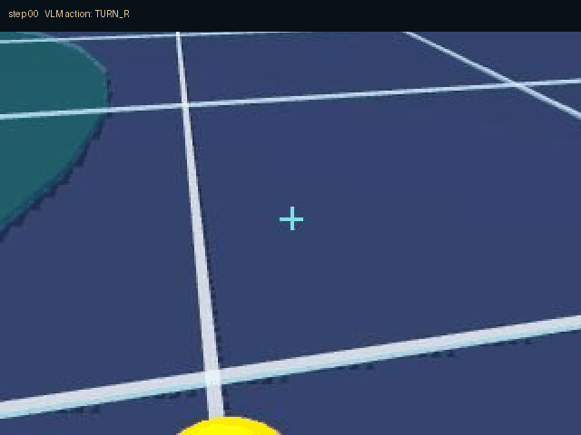
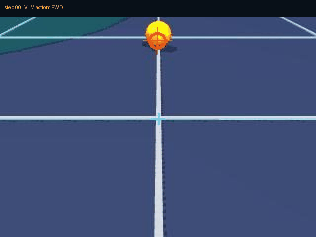

# DuckVLM 实机（云仿真）演示记录 · 2026-09-14

## 1. Zero-shot VLM：严格两步协议

指令：

> Output TURN_R exactly once to rotate right, then on the next step output DONE. Do not output any other motion token.

正式 RoboGo 8080 服务的实际结果：

- 模型：`qwen3-vl-plus`
- 模式：`zero_shot`
- 延迟：约 1.44 s
- 输出：`TURN_R -> DONE`
- `TURN_R` 执行成功
- `DONE` 正常结束 episode
- 服务健康：`{"ok": true, "board": false, "vision": false}`



## 2. dry-run 完整“找球并踢球”

说明：`dry_run` 用于在没有 API 费用和模型非确定性的情况下，验证感知、动作解释、walking ONNX、BallKick、仿真与录制链路。它不是 VLM 推理结果。

实际动作序列：

```text
FWD -> FWD -> FWD -> FWD -> TURN_R -> FWD -> FWD -> FWD -> FWD -> KICK_R -> KICK_R
```

鸭子从头摄视野中找到球，接近后执行右脚 BallKick，两次踢球动作均被 LocalKick 接受。测试最终由操作者停止，步数记录为 10。



## 3. 验证范围

已验证：

- 浏览器 `/vlm` 页面和 API
- Zero-shot 图像 + prompt + 单 token 输出
- token 解析、恢复和动作解释
- 50Hz 仿真控制
- walking ONNX、BallKick、LocalKick 状态机
- 头摄观察、目标 affordance、状态闭环
- 逐步图像与 transition 录制
- `(image, state, action)` -> LLaMA-Factory JSON 导出

尚未验证：

- Gemini / GPT 实际付费 API
- 真实 LoRA 训练质量
- RDK X5 真机摄像头和 Sim2Real